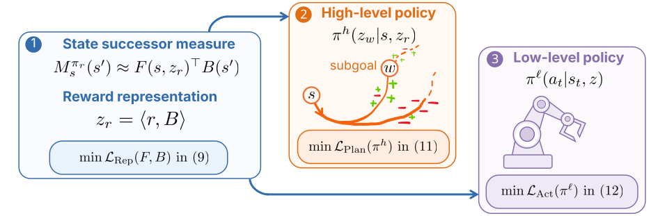

<h1>Switching Successor Measures for Hierarchical Zero-shot Reinforcement Learning</h1>

  <a href="PASTE_PAPER_LINK_HERE">Paper</a> •
  <a href="https://stestokth.github.io/switching-successors/">Project Website</a>

Official implementation of <b>Switching Successor Measures (SSM)</b>, a framework for hierarchical zero-shot reinforcement learning via compositional control with successor-based representations.

<h2>Overview</h2>

We introduce <b>Switching Successor Measures</b>, a hierarchical reinforcement learning framework that enables <b>zero-shot generalization across tasks</b> by switching between learned successor representations.

  

The method builds on Forward-Backward (FB) representations but learns <b>state-based successor measures</b>, enabling compositional long-horizon planning. We further introduce a hierarchical mechanism over these representations, leading to improved performance on navigation and goal-reaching tasks.

This repository includes implementations of:

<ul>
  <li>FB π-Switch (ours)</li>
  <li>FB baseline (w/wo induced high-level policy)</li>
  <li>One-Step FB</li>
  <li>HIQL</li>
  <li>ICVF</li>
</ul>

All methods are evaluated in the offline reinforcement learning setting using OGBench AntMaze tasks.

<h2>Installation</h2>

We use Python 3.11.3 and GCC 12.3.0.

<h3>Create environment</h3>

<pre><code>conda create -n ssm python=3.11
conda activate ssm
</code></pre>

<h3>Install dependencies</h3>

<pre><code>pip install -r requirements.txt
</code></pre>

Some environments (e.g., JAX) may require additional system-specific setup depending on your machine.

<h2>OGBench Datasets</h2>

We use standard datasets from OGBench for pretraining and zero-shot evaluation. All datasets are automatically downloaded to:

<pre><code>~/.ogbench/data
</code></pre>

<h3>AntMaze tasks</h3>

<ul>
  <li>medium navigate: <code>antmaze-medium-navigate-v0</code></li>
  <li>large navigate: <code>antmaze-large-navigate-v0</code></li>
  <li>giant navigate: <code>antmaze-giant-navigate-v0</code></li>
  <li>teleport navigate: <code>antmaze-teleport-navigate-v0</code></li>
</ul>

Each task includes training and validation splits.

<h2>Key Idea</h2>

<ul>
  <li>Learn successor representations of state occupancy</li>
  <li>Switch between subgoal-conditioned policies</li>
  <li>Compose behaviors for long-horizon zero-shot generalization</li>
</ul>

<h2>Acknowledgements</h2>

This codebase builds upon:

<ul>
  <li><a href="https://github.com/seohongpark/ogbench">OGBench</a></li>
  <li><a href="https://github.com/chongyi-zheng/onestep-fb">One-Step FB</a></li>
</ul>

<h2>Citation</h2>

<pre><code>@article{stojanovic2026switching,
  author  = {Stojanovic, Stefan and Proutiere, Alexandre},
  title   = {Switching Successor Measures for Hierarchical Zero-shot Reinforcement Learning},
  journal = {arXiv preprint arXiv:XXXX.XXXXX},
  year    = {2026}
}
</code></pre>

<h2>License</h2>

MIT

